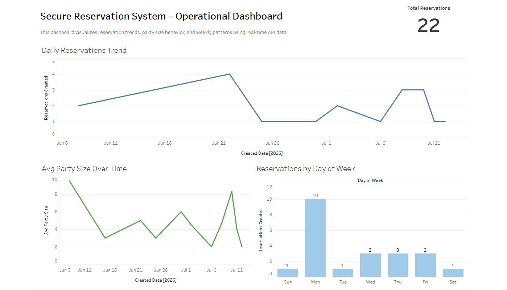

[](https://github.com/Sebastian-Hester/secure-reservation-api/actions/workflows/ci.yml)

# Secure Reservation API

FastAPI + SQLite backend demonstrating secure authentication, role-based access control, and protected data operations.
This dashboard is powered by live data exported from a custom-built FastAPI backend, simulating a real-world analytics pipeline.

## Features
- Health endpoint (`GET /health`)
- User registration with secure password hashing (Argon2)
- JWT login (`POST /auth/login`)
- Protected user endpoint (`GET /me`)
- Authenticated reservations:
  - Create reservation (`POST /reservations`)
  - List your reservations (`GET /reservations`)

## Security Features

- Password hashing using Argon2
- JWT-based authentication and session management
- Protected endpoints requiring valid tokens
- Input validation using pydantic models
- Separation of user data and access control

## 📊 Secure Reservation System – Analytics Dashboard

This dashboard visualizes reservation trends using data generated from a custom-built FastAPI backend. It includes:

- Daily reservation trends
- Average party size over time
- Reservation distribution by day of week
- KPI summary of total reservations

Data is dynamically exported from the API database into CSV files and visualized in Tableau.

**Live Tableau Dashboard:**  

View the live dashboard here:
https://public.tableau.com/views/SecureReservationSystemDashboard/Dashboard1

## Dashboard Preview



### What This Demonstrates
- End-to-end data flow from API → database → analytics → dashboard
- SQL-driven aggregation of operational metrics
- Data visualization for business decision-making
- Secure backend design paired with analytics insights

### Key Metrics Visualized
- Total reservations created
- Daily reservation volume trends
- Average party size trends over time
- Reservations by day of week

### Tech Stack
- FastAPI (Python)
- SQLAlchemy + SQLite
- Alembic migrations
- SQL aggregations
- Tableau Public (dashboard & storytelling)


## Run locally
```bash
python -m venv .venv
# Windows PowerShell:
.venv\Scripts\Activate.ps1
pip install -r requirements.txt
python -m uvicorn app.main:app --reload
```

## Tests
```bash
pytest -q
```

## Example Usage

### Register a User
POST /auth/register

```json
{
  "email": "test@example.com",
  "password": "securepassword"
}
```

## Future Improvements

- Role-based authorization (admin vs user)
- Rate limiting to prevent abuse
- Docker containerization
- Deployment to cloud (AWS/Azure)


